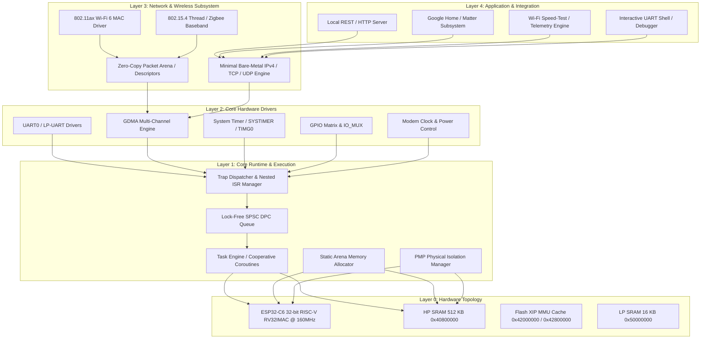
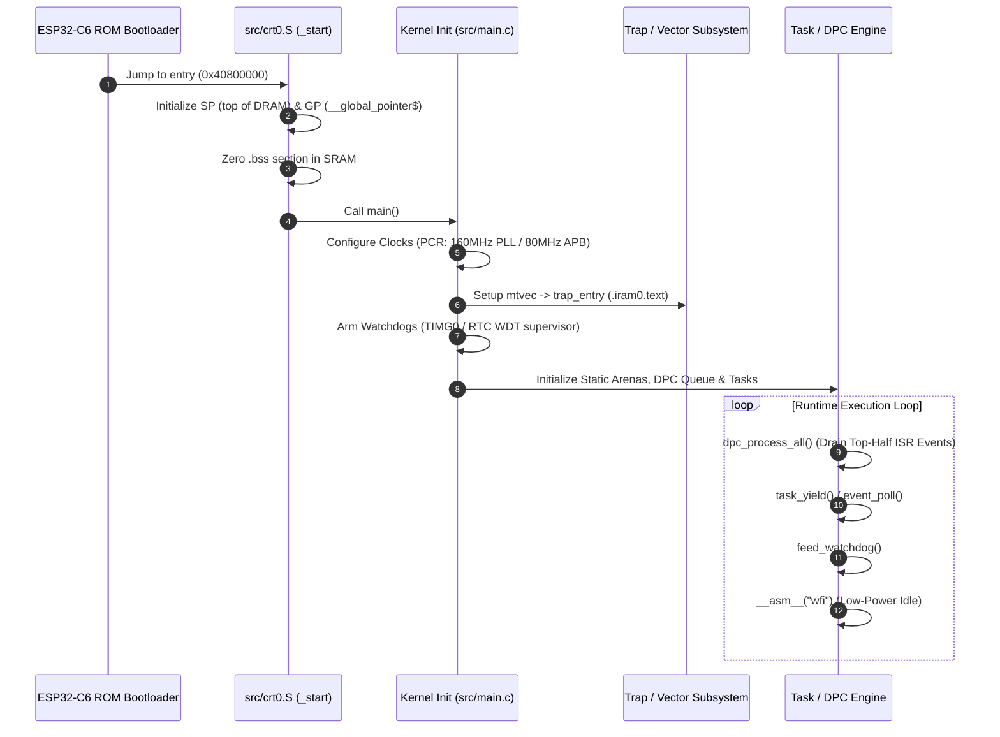

# Iron V: Bare-Metal System Architecture Specification

## Overview
This document defines the complete architectural blueprint for the Iron V bare-metal runtime on the ESP32-C6 (RV32IMAC).

---

## 1. System Topology

---

## 2. Memory Cartography & Address Space Partitioning

| Memory Region | Address Range | Size | Section Attributes | Contents / Allocation |
| :--- | :--- | :--- | :--- | :--- |
| **HP SRAM (IRAM)** | `0x40800000 - 0x4081FFFF` | 128 KB | `.iram0.text`, `.iram0.vectors` | Trap vector (`vector_table`), ISR routines, context switcher, flash algorithms. |
| **HP SRAM (DRAM)** | `0x40820000 - 0x4087FFFF` | 384 KB | `.dram0.data`, `.dram0.bss` | Kernel globals, DPC queue, Task Stacks, Static Arenas, GDMA Descriptors. |
| **Flash IROM (XIP)** | `0x42000000 - 0x423FFFFF` | Up to 4 MB | `.flash.text` | Bulk application logic, HTTP routing, protocol parsers. |
| **Flash DROM (XIP)** | `0x42800000 - 0x429FFFFF` | Up to 2 MB | `.flash.rodata` | Immutable strings, embedded Web UI HTML/CSS assets, certificates. |
| **LP SRAM** | `0x50000000 - 0x50003FFF` | 16 KB | `.lp_sram` | Low-power telemetry, deep-sleep state retention, LP core handover. |

*Ref: ESP32-C6 TRM Chapter 3 (System Memory) & Chapter 4 (System Cache).*

---

## 3. Boot Flow & Core Runtime Lifecycle

---

## 4. Subsystem Specifications

### A. Interrupt & Trap Subsystem
- **Vector Base (`mtvec`):** Direct mode pointing to `trap_entry` aligned to 4 bytes in `.iram0.text`.
- **Interrupt Matrix (`INTERRUPT_CORE0_BASE: 0x60010000`):** Routes hardware sources (UART, GDMA, Timers, Wi-Fi MAC) to 32 CPU interrupt channels (*Ref: TRM Ch. 8*).
- **Priority Controller (`INTPRI_BASE: 0x600C5000`):** Configures channel priority levels (1–15) and dynamic thresholding for nested preemption (*Ref: TRM Ch. 9*).

### B. Asynchronous Execution Pipeline (Top-Half / Bottom-Half)
- **Top-Half (ISR):** Fast MMIO ack, stages DMA descriptors, enqueues atomic event into static SPSC ring buffer `dpc_queue[64]`.
- **Bottom-Half (DPC):** Executed in thread mode to run protocol parsers (HTTP, 802.11 frames, shell commands) without locking interrupts.

### C. Process & Concurrency Model
- **Task Engine:** Lightweight cooperative fibers or priority-based cooperative tasks running on pre-allocated static stacks (e.g., 4KB stack per task).
- **Physical Memory Protection (PMP):** Kernel programs PMP entries `0..3` to lock kernel text/data from user automation scripts (*Ref: RISC-V Privileged Spec v20211203*).

### D. Zero-Copy Wireless & Network Stack
- **GDMA Engine:** Dual-channel circular descriptor rings in HP SRAM for TX/RX.
- **Packet Memory:** Static pool of 64 fixed-size buffers (1536 bytes each = 96 KB total) directly mapped to hardware descriptors.
- **Protocol Flow:** Wi-Fi Baseband RX DMA -> Packet Pool -> DPC Parser -> Local HTTP/REST API Handler.
